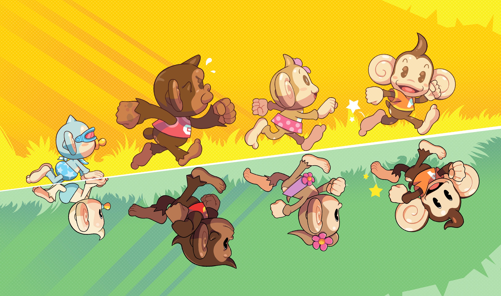

# Super Monkey Ball

**This project does not have any financial purpose. It is only purpose is educational.**

## About the project

Developed by: _Enricco Gemha_

The project started as an implementation of [Roll-a-ball](https://learn.unity.com/project/roll-a-ball?uv=2022.3), an Unity tutorial completed as an assignment for Digital Games at Insper 2024/1.

However, I evolved it to tribute to a Nintendo GameCube classic game, Super Monkey Ball.

## References

- Assets for sound effects and music extracted from: [UltraCavemanSpheresPrototype](https://github.com/grego-git/UltraCavemanSpheresPrototype.git)

- Assets for floor and ocean texture extracted from: [TutsPlus](https://code.tutsplus.com/develop-a-monkey-ball-inspired-game-with-unity--cms-21416t)

- Asset for _Palmera_ trees extracted from: [SketchFab](https://sketchfab.com/3d-models/low-poly-palm-tree-1a7ffd432c99499baccd432a9791d496#_=_)

- Asset for Banana extracted from: [Models Resource](https://www.models-resource.com/gamecube/supermonkeyball/model/24942/)

- Asset for Monkey as easter egg extracted from: [Models Resource](https://www.models-resource.com/gamecube/supermonkeyball/)
